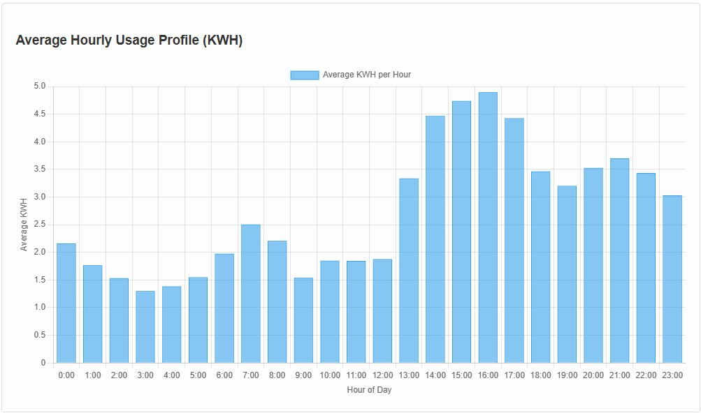

# Electricity Analysis

Energy Analysis of my power bills - using data from the Alinta webapp

The purpose of this app was to provide analysis of my power usage.

This code was created by using Gemini 2.5 Pro (Experimental).

The json files were created by inspecting the network sources for the Alinta web app.

[Online Version](https://electricity-analysis.netlify.app/)

## First Version

The first version allowed for a json file to be uploaded and it would calculate and plot the daily and average hourly values.

## Second Version

The second version calculated and plotted the hourly minimum and maximum.

## Third Version

The third version added a heatmap to show the hourly values across a month.

## Final Version

The final version added the solar information for Brisbane. This was done by assuming a 13.2kWh system facing 40 deg north and a tilt of 20 degrees. Profiles for January and June were calculated.

